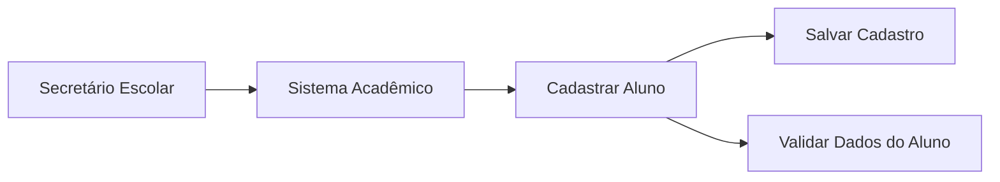
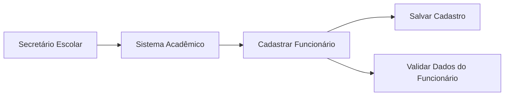
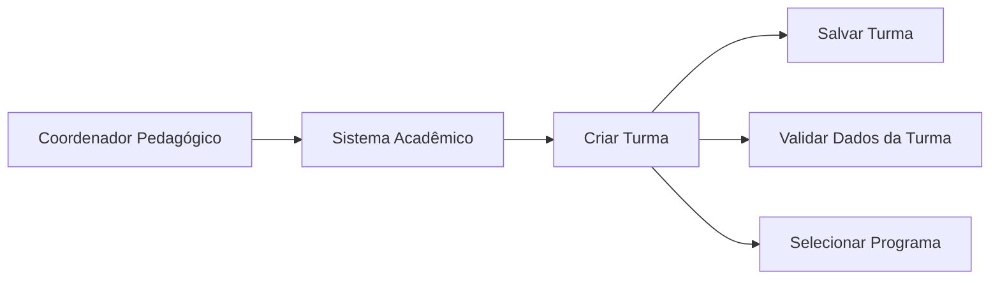
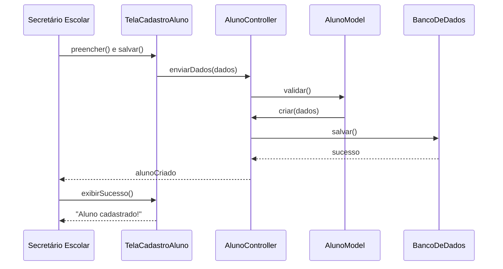
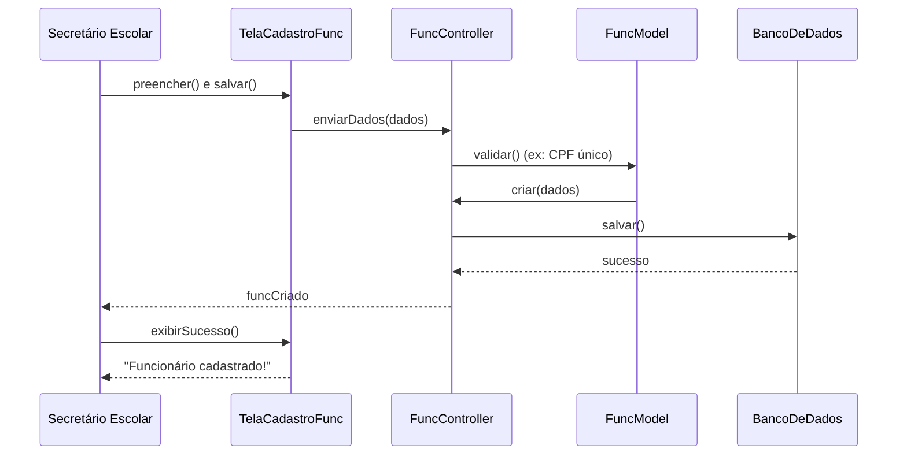
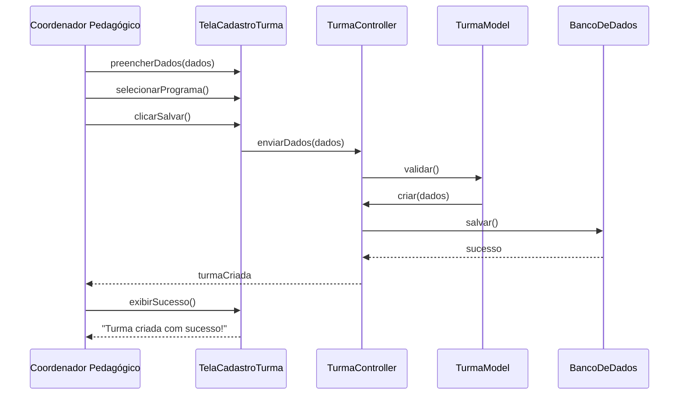

# Entrega 1 - Documento de Requisitos
## Sistema de Gestão Escolar - GUTO

**Autores:** 

Luan Barbosa Rosa Carrieiros
Diego Moreira Rocha
Arthur Clemente Machado
Bernardo Ferreira Temponi
Arthur Gonçalves de Moraes

**Data:** Agosto de 2024  
**Versão:** 1.0  
**Disciplina:** Engenharia de Software II  

---

## 📋 Visão Geral

Este documento detalha os **requisitos funcionais e não funcionais** para o desenvolvimento do Sistema GUTO, uma plataforma web de gestão escolar. O objetivo do projeto é criar uma solução integrada para otimizar os processos administrativos e acadêmicos de uma instituição de ensino, centralizando as informações de alunos, funcionários, turmas e avaliações em um único ambiente, acessível a diferentes perfis de usuários.

---

## 🎯 Escopo do Sistema

O escopo do Sistema GUTO abrange os seguintes **módulos principais**:

### 📚 **Gestão de Alunos**
- Cadastro completo
- Matrículas
- Enturmação
- Gestão de documentos

### 👨‍🏫 **Gestão de Funcionários**
- Cadastro de docentes e outros funcionários
- Dados pessoais e funcionais

### 🏫 **Estrutura Acadêmica**
- Configuração de programas pedagógicos
- Disciplinas
- Grades curriculares

### 📊 **Avaliação**
- Lançamento de notas
- Faltas
- Pareceres
- Gestão do diário online

### ⚙️ **Administrativo e Utilitários**
- Gestão de usuários
- Permissões
- Relatórios gerais
- Outras ferramentas de suporte

### 🚌 **Transporte Escolar**
- Gerenciamento de rotas
- Veículos
- Alunos transportados

---

## 👥 Atores do Sistema

Os principais usuários (atores) que interagirão com o sistema são:

### 📋 **Secretário(a) Escolar**
- Responsável pela maior parte das operações de cadastro, matrícula e enturmação

### 👨‍🏫 **Professor(a)**
- Responsável pelo lançamento de notas, faltas e conteúdos no diário online

### 👑 **Diretor(a) / Coordenador(a)**
- Responsável pela supervisão, configuração de regras de negócio e acesso a relatórios gerenciais

---

## 📋 Casos de Uso Principais

### 1. Cadastrar Aluno

**Fluxo Principal:**
1. Secretário acessa o sistema
2. Seleciona "Cadastrar Aluno"
3. Preenche dados obrigatórios
4. Sistema valida informações
5. Dados são salvos com sucesso

### 2. Cadastrar Funcionário

**Fluxo Principal:**
1. Secretário acessa o sistema
2. Seleciona "Cadastrar Funcionário"
3. Preenche dados pessoais e funcionais
4. Sistema valida informações (ex: CPF único)
5. Dados são salvos com sucesso

### 3. Criar Turma

**Fluxo Principal:**
1. Coordenador acessa o sistema
2. Seleciona "Criar Turma"
3. Define informações básicas (nome, período, turno)
4. Seleciona programa pedagógico
5. Sistema valida dados e salva turma

---

## 🔄 Diagramas de Sequência

### Cadastrar Aluno

### Cadastrar Funcionário

### Criar Turma

---

## 🖼️ Protótipos das Telas

### Tela de Cadastro de Aluno

**Características:**
- **Dados Básicos**        : Nome completo, data de nascimento, sexo
- **Filiação**             : Informações dos pais/responsáveis
- **Informações Especiais**: Flags para situações específicas
- **Dados Adicionais**     : Observações e foto do aluno
- **Validação Visual**     : Campos obrigatórios destacados em verde
- **Interface Responsiva** : Adaptável para diferentes dispositivos

### Tela de Cadastro de Funcionário

**Características:**
- **Sistema de Abas**: Organização por categorias
  - 👤 Informações Pessoais
  - 📞 Contato
  - 🏠 Endereço
  - 💼 Dados Funcionais
  - 📝 Observações
- **Validação**: Campos obrigatórios identificados
- **Auto-save**: Salvamento automático ao trocar de aba

### Tela de Criação de Turma

**Características:**
- **Informações Básicas**: Nome, período letivo
- **Classificação**      : Tipo de ensino, ano/série, turno
- **Dicas Contextuais**  : Orientações para preenchimento
- **Interface Limpa**    : Foco na usabilidade

---

## 📖 Especificação Detalhada de Requisitos

### 🎓 Módulo 1: Aluno

#### 1.1 Cadastro de Aluno

##### Requisitos Funcionais (RF)

|     ID    | PRIORIDADE |     Descrição                                                                                                                                  |
|-----------|------------|------------------------------------------------------------------------------------------------------------------------------------------------|
| **RF101** |    Alta    | O sistema deve ter uma tela de Pesquisa de Alunos como ponto de entrada para o cadastro                                                        |
| **RF102** |    Alta    | A pesquisa deve permitir buscar por Nome do Aluno ou por Código do Aluno                                                                       |
| **RF103** |    Média   | A pesquisa deve conter filtros: Exibir Arquivo Corrente, Exibir do Arquivo Permanente, Exibir Todos, e Aluno Gêmeo                             |
| **RF104** |    Alta    | A tela de pesquisa deve conter os botões: Incluir, Alterar, Consultar, Excluir, Imprimir e Fechar                                              |
| **RF105** |    Alta    | Ao clicar em Incluir, o sistema deve abrir o formulário Cadastro de Aluno                                                                      |
| **RF106** |    Alta    | O formulário de Cadastro Básico deve conter: Código, Nome, Nome Social, Data de Nascimento, Sexo, Nome da mãe e Nome do pai                    |
| **RF107** |    Média   | O formulário deve incluir checkboxes para Mãe não declarada, Pai não declarado e Aluno Gêmeo                                                   |
| **RF108** |    Média   | O formulário deve conter campo Lembrete e checkboxes para Falta Histórico Escolar e Aluno exclusivo de AEE                                     |
| **RF109** |    Alta    | Após gravar novo aluno, exibir mensagem: "Inclusão do Aluno realizada com sucesso."                                                            |
| **RF110** |    Média   | Após sucesso, exibir pop-up: "Deseja completar Cadastro/Matrícula/Enturmação?"                                                                 |
| **RF111** |    Alta    | O formulário deve conter botão Dados Estendidos para cadastro completo                                                                         |
| **RF113** |    Média   | A aba Identificação do Aluno deve permitir upload de Foto                                                                                      |
| **RF114** |    Média   | A aba Documentação do Aluno deve permitir marcar "O(a) Aluno(a) não possui os documentos" ou "A escola não dispõe ou não recebeu os documentos"|
| **RF115** |    Baixa   | A aba Transporte deve habilitar campos adicionais se Utiliza for selecionada                                                                   |
| **RF116** |    Alta    | O sistema deve permitir Alterar o cadastro de um aluno selecionado                                                                             |
| **RF117** |    Média   | Na alteração, deve ser possível mover aluno para Arquivo Permanente                                                                            |
| **RF118** |    Alta    | O sistema deve permitir Excluir um aluno com confirmação: "Deseja realmente excluir?"                                                          |
| **RF119** |    Média   | O sistema deve permitir Imprimir relatório simples com Código, Nome e Data de Nascimento                                                       |
| **RF112** |    Alta    | Cadastro Estendido com abas: Identificação do Aluno, Identificação do Responsável, Documentação do Aluno, Documentação do Pai, Documentação da |
                         | Mãe, Dados de Saúde, Informações Adicionais, Necessidades Educacionais Especiais e Transporte                                                  |

##### Requisitos Não Funcionais (RNF)

|     ID     |   CATEGORIA      |   Descrição                                                                          |
|------------|------------------|--------------------------------------------------------------------------------------|
| **RNF101** | Regra de Negócio | O Código do aluno deve ser gerado automaticamente e não editável                     |
| **RNF102** | Regra de Negócio | Cada aluno pode ter apenas um cadastro no sistema                                    |
| **RNF103** |     Validação    | Campos destacados (em verde) são de preenchimento obrigatório                        |
| **RNF104** | Regra de Negócio | Nome Social, quando preenchido, deve ser exibido nos relatórios específicos          |
| **RNF106** |    Usabilidade   | Se pesquisa não retornar resultados, exibir: "Nenhum registro encontrado."           |
| **RNF107** | Regra de Negócio | Não é possível excluir aluno que possua vínculos no sistema                          |
| **RNF108** |      Acesso      | O Responsável cadastrado deve ter acesso aos relatórios específicos                  |
| **RNF109** |    Usabilidade   | No Cadastro Estendido, dados devem ser salvos automaticamente ao mudar de aba        |
| **RNF105** | Regra de Negócio | Arquivo Corrente exibe alunos com matrícula ativa; Arquivo Permanente exibe inativos |

#### 1.2 Matrícula

##### Requisitos Funcionais (RF)

|     ID    | PRIORIDADE |   Descrição                                                                                                |
|-----------|------------|------------------------------------------------------------------------------------------------------------|
| **RF201** |    Alta    | O módulo deve permitir: Incluir, Alterar, Consultar, Excluir, Encerrar, Reativar e Imprimir matrículas     |
| **RF202** |    Alta    | A pesquisa deve permitir buscar alunos por Nome/Código e filtrar por Tipo de Matrícula                     |
| **RF204** |    Média   | Formulário deve ter seção Opções para matrícula com ano em andamento                                       |
| **RF205** |    Média   | Formulário deve ter seção Condições especiais para avaliação do aluno                                      |
| **RF206** |    Média   | Formulário deve ter seção Condição anterior do aluno com campos como Novato                                |
| **RF207** |    Alta    | O sistema deve permitir Encerrar matrícula preenchendo Data de Encerramento e Motivo                       |
| **RF208** |    Alta    | O sistema deve permitir Reativar matrícula com confirmação sobre perda de dados                            |
| **RF203** |    Alta    | Ao Incluir matrícula, formulário deve conter: Ano administrativo, Tipo de ensino, Ano/Série/Módulo/Etapa,  |
                         | Turno Preferencial, Data da Matrícula e Possui Dependência                                                 |

##### Requisitos Não Funcionais (RNF)

|     ID     |   CATEGORIA      |   Descrição                                                                              |
|------------|------------------|------------------------------------------------------------------------------------------|
| **RNF201** | Regra de Negócio | O campo Ano administrativo não pode ser alterado após criação da matrícula               |
| **RNF202** | Regra de Negócio | Não é possível alterar matrícula já encerrada                                            |
| **RNF204** | Regra de Negócio | O botão Reativar deve estar desabilitado se matrícula estiver no Arquivo Permanente      |
| **RNF203** | Regra de Negócio | Não é possível excluir matrículas encerradas, de alunos enturmados ou de chamada pública |

#### 1.3 Enturmação

##### Requisitos Funcionais (RF)

|     ID    | PRIORIDADE |   Descrição                                                                                                                               |
|-----------|------------|-------------------------------------------------------------------------------------------------------------------------------------------|
| **RF302** |    Alta    | A tela deve ter dois painéis: Alunos Matriculados (disponíveis) e Alunos Enturmados (na turma)                                            |
| **RF303** |    Alta    | Deve ser possível Adicionar aluno da lista de matriculados para enturmados                                                                |
| **RF304** |    Alta    | Deve ser possível Remover aluno da turma                                                                                                  |
| **RF305** |    Alta    | Deve ser possível Remanejar aluno, mantendo na turma origem com status "R"                                                                |
| **RF306** |    Média   | O sistema deve permitir dispensa de alunos em disciplinas específicas                                                                     |
| **RF301** |    Alta    | O módulo deve permitir: Adicionar, Remover, Remanejar, Abrir/Fechar diário, Alterar Data de Enturmação, Dispensa em lote e Ordenar Diário |

##### Requisitos Não Funcionais (RNF)

|     ID     |   CATEGORIA      |   Descrição                                                               |
|------------|------------------|---------------------------------------------------------------------------|
| **RNF301** | Regra de Negócio | Se aluno possuir lançamentos, não pode ser removido, apenas remanejado    |
| **RNF302** | Regra de Negócio | Alunos adicionados após fechamento do diário devem ser listados ao final  |
| **RNF303** | Regra de Negócio | Ao abrir diário já fechado, alunos com status "Remanejado" são removidos  |
| **RNF304** | Regra de Negócio | Ao dispensar aluno, carga horária é somada ao total. "Não Optou" não soma |

---

### 👨‍🏫 Módulo 2: Funcionário

#### 2.1 Cadastro de Funcionário

##### Requisitos Funcionais (RF)

|     ID    | PRIORIDADE |   Descrição                                                                                     |
|-----------|------------|-------------------------------------------------------------------------------------------------|
| **RF401** |    Alta    | O módulo deve permitir: Incluir, Alterar, Consultar, Excluir e Imprimir                         |
| **RF402** |    Média   | Ao Incluir, primeiro abrir tela para buscar funcionário na rede por Nome, CPF ou Matrícula      |
| **RF403** |    Alta    | Se funcionário não encontrado, botão Novo deve ser habilitado para criar cadastro               |
| **RF405** |    Média   | A aba Dados Funcionais deve permitir registro de duplo vínculo                                  |
| **RF406** |    Média   | O sistema deve permitir mover funcionário para Arquivo Permanente                               |
| **RF407** |    Baixa   | Gerar dois tipos de relatório: Lista Simples e Folha de Frequência Mensal                       |
| **RF404** |    Alta    | Formulário dividido em abas: Dados Pessoais, Documentação, Dados Funcionais, Habilitação, Dados |
                         | de Escolaridade, Formação Superior, Disponibilidade, Disciplinas e Deficiência                  |

##### Requisitos Não Funcionais (RNF)

|     ID     |   CATEGORIA      |   Descrição                                                                                  |
|------------|------------------|----------------------------------------------------------------------------------------------|
| **RNF402** | Regra de Negócio | Campo Matrícula deve ser verificado para garantir unicidade na rede                          |
| **RNF403** | Regra de Negócio | Apenas funcionários com Função Docente devem aparecer na associação de professores           |
| **RNF404** | Regra de Negócio | Não é possível excluir funcionário já associado a uma turma                                  |
| **RNF401** |     Validação    | Campos em verde são obrigatórios. Sistema não deve permitir gravar ou mudar de aba se vazios |

#### 2.2 Associar Professor

##### Requisitos Funcionais (RF)

|     ID    | PRIORIDADE |   Descrição                                                                                                                         |
|-----------|------------|-------------------------------------------------------------------------------------------------------------------------------------|
| **RF501** |    Alta    | O sistema deve permitir associar professores a turmas e disciplinas                                                                 |
| **RF502** |    Alta    | Permitir filtrar por Tipo de Associação: Disciplina, Turma ou Turma AEE/AC                                                          |
| **RF503** |    Média   | Apresentar tela de Histórico de Docente mostrando datas de Início e Término                                                         |
| **RF504** |    Alta    | Permitir substituição de professor registrando datas de término e início                                                            |
| **RF506** |    Baixa   | Deve haver opção "Disciplina não possui docente"                                                                                    |
| **RF505** |    Média   | Permitir associar outros profissionais: Auxiliar/Assistente Educacional, Profissional/Monitor de AC e Tradutor Intérprete de LIBRAS |

##### Requisitos Não Funcionais (RNF)

|     ID     |   CATEGORIA      |   Descrição                                                                     |
|------------|------------------|---------------------------------------------------------------------------------|
| **RNF501** | Regra de Negócio | Exibir "Associação não permitida" para disciplinas incompatíveis                |
| **RNF502** | Regra de Negócio | É permitida associação de apenas um Tradutor Intérprete de LIBRAS por turma     |
| **RNF503** | Regra de Negócio | Associar "Disciplina não possui docente" deve bloquear lançamentos de avaliação |
| **RNF504** |   Persistência   | Todas as associações só são salvas quando usuário clica "Gravar"                |

---

### ⚙️ Módulos Complementares

#### Módulo 3: Opções
- **Documentos**        : Hub para emitir relatórios (Ficha de Matrícula, Boletim, etc.)
- **Calendário Escolar**: Exibição e impressão do calendário

#### Módulo 4: AEE/Atividade Complementar
- **Cadastro de Turmas**      : AEE e Atividade Complementar
- **Enturmação Especializada**: Busca em diferentes escolas

#### Módulo 5: Avaliação
- **Lançamentos**              : Notas, conceitos, faltas
- **Diário Online**            : Processo em 3 etapas (Turma → Disciplina → Divisão)
- **Funcionalidades Avançadas**: Recuperação especial, parecer descritivo

#### Módulos 6-12: Utilitários, Escola, Aplicativo, Censo, Programa, Suporte, Transporte
- Funcionalidades específicas para gestão completa do ambiente educacional

---

## 🎯 Conclusão

Este documento estabelece a **base sólida** para o desenvolvimento do Sistema GUTO, definindo claramente:

### ✅ **Entregas Realizadas**
- **Casos de Uso Detalhados**: Para os 3 principais fluxos
- **Diagramas de Sequência** : Representação técnica dos processos
- **Protótipos de Interface**: Validação visual das funcionalidades
- **Especificação Completa** : 100+ requisitos funcionais e não funcionais

### 🚀 **Próximos Passos**
1. **Validação dos Requisitos** com stakeholders
2. **Refinamento dos Protótipos** baseado no feedback
3. **Planejamento da Arquitetura** de software
4. **Início do Desenvolvimento** dos módulos prioritários

### 📊 **Impacto Esperado**
O Sistema GUTO **revolucionará** a gestão educacional através de:
- **Centralização** de informações
- **Automatização** de processos
- **Redução** de redundâncias
- **Melhoria** na tomada de decisões

---

**Documento elaborado com foco na qualidade, completude e viabilidade técnica para garantir o sucesso do projeto Sistema GUTO.**