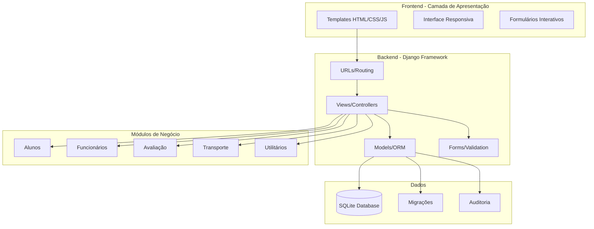
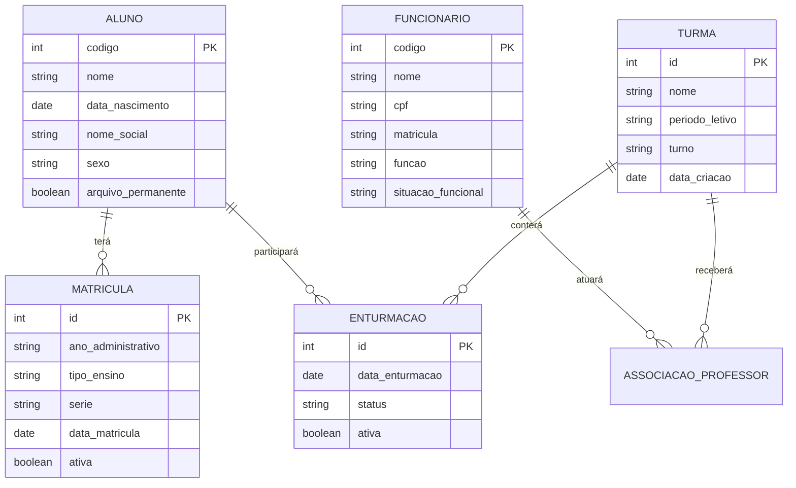
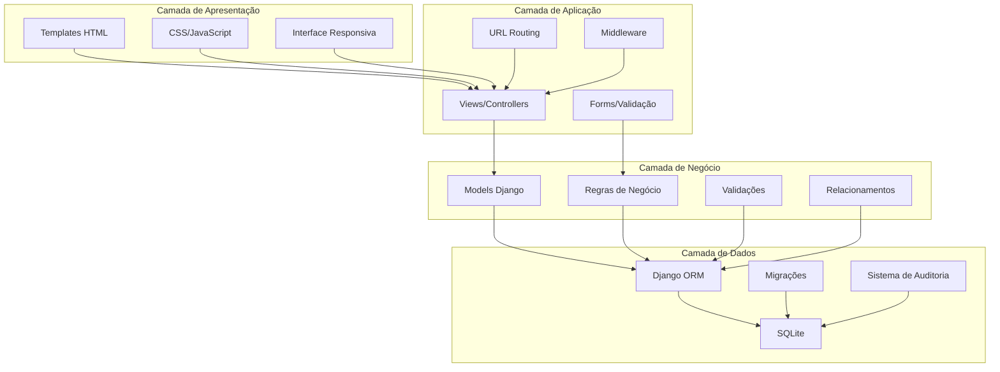
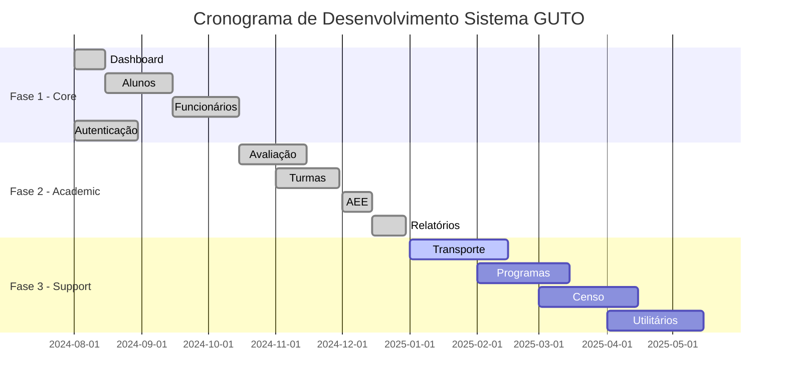

# Documento de Arquitetura de Software
## Sistema de Gestão Escolar - GUTO

**Autores:** 

Luan Barbosa Rosa Carrieiros
Diego Moreira Rocha
Arthur Clemente Machado
Bernardo Ferreira Temponi
Arthur Gonçalves de Moraes
  

**Data:** Agosto de 2024  
**Versão:** 1.0  
**Fase:** Planejamento Arquitetural  

---

## 1. Introdução

### 1.1 Objetivo

Este documento descreve a arquitetura de software **proposta** para o Sistema GUTO (Gestão Unificada de Tecnologia e Organização), uma plataforma web completa para gestão escolar. O objetivo é estabelecer as diretrizes técnicas, estrutura de componentes, tecnologias e decisões arquiteturais que **orientarão** o desenvolvimento do sistema.

### 1.2 Escopo do Sistema

O Sistema GUTO **será** uma solução integrada de gestão educacional que **abrangerá**:

- **Gestão de Alunos**             : Cadastro completo, matrículas, enturmação e documentação
- **Gestão de Funcionários**       : Controle de pessoal docente e administrativo
- **Avaliação Acadêmica**          : Sistema completo de notas, conceitos e diário online
- **AEE/Atividades Complementares**: Atendimento educacional especializado
- **Transporte Escolar**           : Gestão de rotas, veículos e alunos transportados
- **Utilitários**                  : Ferramentas administrativas, relatórios e configurações
- **Integração Censo Escolar**     : Geração de dados para órgãos oficiais

---

## 2. Visão Geral da Arquitetura

### 2.1 Estilo Arquitetural

O Sistema GUTO **adotará** uma **arquitetura monolítica em camadas** baseada no padrão **MVT (Model-View-Template)** do Django Framework, com as seguintes características **planejadas**:

- **Arquitetura Web de 3 Camadas** (Apresentação, Lógica, Dados)
- **Padrão MVT** para organização do código
- **Arquitetura Modular** com apps Django independentes
- **Separação de Responsabilidades** entre componentes

### 2.2 Camadas Arquiteturais Propostas

```
┌─────────────────────────────────────────────────────────┐
│               CAMADA DE APRESENTAÇÃO                    │
├─────────────────────────────────────────────────────────┤
│  • Templates HTML (Django Templates)                    │
│  • CSS (Tailwind CSS) + JavaScript (Alpine.js, HTMX)    │
│  • Interface Responsiva e Interativa                    │
└─────────────────────────────────────────────────────────┘
                              ↕
┌─────────────────────────────────────────────────────────┐
│                 CAMADA DE APLICAÇÃO                     │
├─────────────────────────────────────────────────────────┤
│  • Views (Function-Based Views)                         │
│  • URLs e Roteamento                                    │
│  • Forms e Validações                                   │
│  • Sistema de Autenticação e Autorização                │
└─────────────────────────────────────────────────────────┘
                              ↕
┌─────────────────────────────────────────────────────────┐
│                  CAMADA DE NEGÓCIO                      │
├─────────────────────────────────────────────────────────┤
│  • Models (Django ORM)                                  │
│  • Regras de Negócio                                    │
│  • Validações de Integridade                            │
│  • Relacionamentos Complexos                            │
└─────────────────────────────────────────────────────────┘
                              ↕
┌─────────────────────────────────────────────────────────┐
│                   CAMADA DE DADOS                       │
├─────────────────────────────────────────────────────────┤
│  • SQLite Database (Desenvolvimento)                    │
│  • Django ORM como Abstração                            │
│  • Sistema de Migrações                                 │
│  • Auditoria e Log de Atividades                        │
└─────────────────────────────────────────────────────────┘
```

---

## 3. Componentes Principais

### 3.1 Estrutura Modular Planejada

O sistema **será organizado** em **11 módulos Django** independentes:

#### **3.1.1 Módulos Core (Prioridade Alta)**
- **`dashboard/`**    - Interface principal e agregação de dados
- **`alunos/`**       - Gestão completa de alunos e matrículas
- **`funcionarios/`** - Gestão de pessoal educacional
- **`avaliacao/`**    - Sistema de avaliação e diário online

#### **3.1.2 Módulos Especializados (Prioridade Média)**
- **`aee/`**         - Atendimento Educacional Especializado
- **`escola/`**      - Itinerários formativos (Novo Ensino Médio)
- **`utilitarios/`** - Ferramentas administrativas
- **`opcoes/`**      - Configurações e relatórios

#### **3.1.3 Módulos Complementares (Prioridade Baixa)**
- **`transporte/`** - Gestão de transporte escolar
- **`programa/`**   - Programas pedagógicos
- **`censo/`**      - Integração com Censo Escolar

### 3.2 Componentes por Camada (Arquitetura Proposta)

#### **3.2.1 Modelos de Dados (80+ Models Planejados)**

**Alunos (5 Models Principais):**
```python
# Estrutura planejada para o módulo Alunos
Aluno (Principal) → DocumentacaoAluno (1:1) → Responsavel (1:N)
                 → TransporteAluno (1:1) → Matricula (1:N)
```

**Funcionários (12 Models Planejados):**
```python
# Estrutura planejada para o módulo Funcionários
Funcionario → DadosFuncionais (1:1) → DocumentacaoFuncionario (1:1)
           → Habilitacao (1:N) → AssociacaoProfessor (1:N)
```

**Avaliação (16 Models Planejados):**
```python
# Estrutura planejada para o módulo Avaliação
Turma → Enturmacao (M:N) → LancamentoNota (1:N) → Conceito
      → DiarioOnline → ParecerDescritivo → AvaliacaoDescritiva
```

#### **3.2.2 Controladores (120+ Views Planejadas)**

**Padrões que serão implementados:**
- **CRUD Completo**              : Create, Read, Update, Delete para entidades principais
- **Function-Based Views**       : Padrão consistente em todos os módulos
- **Decorador `@login_required`**: Controle de acesso universal
- **Sistema de Mensagens**       : Feedback consistente para o usuário

**Views planejadas por Módulo:**
- **Alunos**      : 16 views (CRUD + matrículas + relatórios)
- **Funcionários**: 17 views (CRUD + associações + validações)
- **Avaliação**   : 13 views (turmas + notas + diário online)

#### **3.2.3 Templates (35+ Templates Planejados)**

**Tecnologias selecionadas:**
- **Django Templates**: Sistema de templates nativo
- **Tailwind CSS 3.x**: Framework CSS utilitário
- **HTMX 2.0**        : Interatividade e AJAX
- **Alpine.js 3.x**   : Componentes JavaScript reativos

**Estrutura de Templates proposta:**
```html
base.html (Template Principal)
├── dashboard/home.html
├── alunos/
│   ├── aluno_list.html
│   ├── aluno_form.html
│   ├── aluno_detail.html
│   └── matricula_form.html
├── funcionarios/
│   ├── funcionario_list.html
│   ├── funcionario_form.html
│   └── funcionario_edit_extended.html
└── [outros módulos]
```

---

## 4. Diagramas Arquiteturais

### 4.1 Diagrama de Componentes Proposto



### 4.2 Diagrama de Domínio (Principais Entidades Planejadas)



### 4.3 Diagrama de Camadas



---

## 5. Tecnologias Utilizadas

### 5.1 Linguagens e Frameworks **Selecionados**

#### **Backend:**
- **Python 3.12+**                 - Linguagem principal
- **Django 5.2.5**                 - Framework web principal
- **Django REST Framework 3.16.1** - API REST

#### **Frontend:**
- **HTML5**            - Estrutura semântica
- **Tailwind CSS 3.x** - Framework CSS utilitário
- **JavaScript ES6+**  - Interatividade
- **HTMX 2.0.3**       - Interações AJAX declarativas
- **Alpine.js 3.x**    - Componentes reativos leves

#### **Adicionais:**
- **Font Awesome 6.0**     - Biblioteca de ícones
- **Google Fonts (Inter)** - Tipografia

### 5.2 Banco de Dados **Planejado**

- **SQLite 3**             - Banco de dados principal (desenvolvimento)
- **Django ORM**           - Mapeamento objeto-relacional
- **Sistema de Migrações** - Controle de versão do banco
- **PostgreSQL**           - Migração futura para produção

### 5.3 Ferramentas de Desenvolvimento **Definidas**

#### **Dependências Python:**
```python
Django==5.2.5
djangorestframework==3.16.1
pillow==11.3.0  # Processamento de imagens
python-decouple==3.8  # Configurações
```

#### **Versionamento:**
- **Git**    - Controle de versão
- **GitHub** - Repositório remoto

#### **Deploy:**
- **Servidor Django**    - Desenvolvimento local
- **Arquivos Estáticos** - Servidos pelo Django
- **Media Files**        - Upload e gerenciamento de imagens

---

## 6. Padrões e Convenções

### 6.1 Padrões Arquiteturais **Adotados**

#### **6.1.1 Padrão MVT (Model-View-Template)**
- **Models**   : Definição de dados e regras de negócio
- **Views**    : Lógica de controle e processamento
- **Templates**: Apresentação e interface do usuário

#### **6.1.2 Padrão Repository (via Django ORM)**
- **Managers Customizados**: Para queries complexas
- **QuerySets**            : Abstração de consultas ao banco
- **Relacionamentos**      : ForeignKey, OneToOne, ManyToMany

### 6.2 Convenções de Código **Estabelecidas**

#### **6.2.1 Nomenclatura:**
- **Models**   : PascalCase (ex: `DocumentacaoAluno`)
- **Views**    : snake_case (ex: `aluno_list`)
- **URLs**     : kebab-case (ex: `aluno-cadastrar`)
- **Templates**: snake_case (ex: `aluno_form.html`)

#### **6.2.2 Estrutura de Diretórios:**
```
app_name/
├── __init__.py
├── admin.py          # Configuração do admin
├── apps.py           # Configuração da app
├── models.py         # Modelos de dados
├── views.py          # Controladores
├── urls.py           # Rotas
├── forms.py          # Formulários
├── tests.py          # Testes unitários
├── migrations/       # Migrações do banco
└── management/       # Comandos customizados
    └── commands/
```

### 6.3 Boas Práticas **Planejadas**

#### **6.3.1 Segurança:**
- **CSRF Protection**         : Habilitado em todos os formulários
- **SQL Injection Prevention**: Django ORM
- **XSS Protection**          : Escape automático de templates
- **Autenticação Obrigatória**: `@login_required` em todas as views

#### **6.3.2 Validação de Dados:**
- **Validação Client-Side**: JavaScript para UX
- **Validação Server-Side**: Django Forms
- **Regras de Negócio**    : Models e custom validators

#### **6.3.3 Auditoria:**
- **Campos de Auditoria**: `data_cadastro`, `usuario_cadastro`
- **Log de Atividades**  : Sistema centralizado no dashboard
- **Rastreabilidade**    : Controle de quem faz o quê

---

## 7. Requisitos Não Funcionais

### 7.1 Escalabilidade

#### **Arquitetura Inicial:**
- **Arquitetura Monolítica**: Adequada para organizações de médio porte
- **SQLite**                : **Suportará** até ~100 usuários simultâneos (mas depois será hospedado com postgree na azure)
- **Recursos Básicos**      : CPU/RAM moderados

#### **Estratégias de Crescimento Futuro:**
- **Migração para PostgreSQL**: Para maior escalabilidade
- **Cache Redis**             : Para otimização de consultas
- **Load Balancing**          : Para distribuição de carga

### 7.2 Segurança

#### **Controles que serão implementados:**
- **Autenticação Django**   : Sistema robusto de usuários
- **Autorização por Grupos**: Controle granular de acesso
- **HTTPS Ready**           : Configurações preparadas
- **Validação de Entrada**  : Sanitização completa

#### **Exemplo de Controle Planejado:**
```python
# Exemplo de controle a ser implementado
@login_required
def aluno_delete(request, pk):
    # Verificação de vínculos antes da exclusão
    if aluno.matriculas.exists():
        messages.error(request, 'Não é possível excluir aluno com matrículas')
        return redirect('alunos:aluno_detail', pk=pk)
```

### 7.3 Desempenho

#### **Otimizações Planejadas:**
- **Django ORM Otimizado**: Select_related, prefetch_related
- **Paginação**           : Limitação de registros por página (50 items)
- **Índices de Banco**    : Automáticos via Django
- **CSS/JS Otimizado**    : Via CDN para frameworks

#### **Metas de Performance:**
- **Tempo de Resposta**: < 200ms para operações básicas
- **Capacidade**       : ~50 usuários simultâneos (desenvolvimento)
- **Escalabilidade**   : Preparado para migração

### 7.4 Manutenibilidade

#### **Estrutura Modular Planejada:**
- **Apps Independentes**  : Baixo acoplamento entre módulos
- **Código Documentado**  : Docstrings em funções complexas
- **Padrões Consistentes**: Mesma estrutura em todos os módulos

#### **Facilidades de Manutenção:**
- **Sistema de Migrações**: Versionamento automático do banco
- **Debug Toolbar**       : Ferramenta de desenvolvimento
- **Admin Django**        : Interface administrativa pronta

### 7.5 Usabilidade

#### **Interface Responsiva Planejada:**
- **Mobile-First**         : Design adaptativo
- **Acessibilidade Básica**: Estrutura semântica
- **Feedback Visual**      : Mensagens de sucesso/erro

#### **Experiência do Usuário Pretendida:**
- **Navegação Intuitiva**    : Menu lateral fixo
- **Busca Avançada**         : Filtros em listagens principais
- **Validação em Tempo Real**: Feedback imediato

---

## 8. Riscos Arquiteturais

### 8.1 Limitações Técnicas **Identificadas**

#### **8.1.1 Banco de Dados:**
- **SQLite**    : Limitado para alta concorrência
- **Backup**    : Processo manual
- **Replicação**: Não suportada nativamente

**Mitigação**: Migração para PostgreSQL planejada para fase 2

#### **8.1.2 Escalabilidade:**
- **Monolito**: Dificuldade para escalar componentes específicos
- **Sessões** : Armazenadas localmente
- **Arquivos**: Sistema de arquivos local

**Mitigação**: Arquitetura preparada para evolução incremental

### 8.2 Dependências Externas

#### **8.2.1 CDNs:**
- **Tailwind CSS**  : Dependência externa via CDN
- **HTMX/Alpine.js**: Bibliotecas externas
- **Font Awesome**  : Serviço de terceiros

**Mitigação**: Implementar fallbacks locais para recursos críticos

#### **8.2.2 Framework Django:**
- **Atualizações**: Necessidade de manter compatibilidade
- **Segurança**   : Dependente das correções do Django
- **Performance** : Limitada pelas escolhas do framework

**Mitigação**: LTS version e roadmap de atualizações

### 8.3 Riscos de Negócio

#### **8.3.1 Complexidade:**
- **80+ Models**: Alta complexidade de relacionamentos
- **120+ Views**: Muitos pontos de entrada no sistema
- **11 Módulos**: Interdependências complexas

**Mitigação**: Desenvolvimento incremental por módulos prioritários

#### **8.3.2 Manutenção:**
- **Código Customizado**: Específico para domínio educacional
- **Regras de Negócio** : Complexas e específicas do setor
- **Integrações**       : Dependência de padrões externos (INEP, etc.)

**Mitigação**: Documentação detalhada e equipe capacitada

---

## 9. Decisões Arquiteturais

### 9.1 Escolha do Django Framework

#### **Justificativas:**
1. **Produtividade**  : RAD (Rapid Application Development)
2. **Admin Interface**: Interface administrativa automática
3. **ORM Robusto**    : Abstração completa do banco de dados
4. **Segurança**      : Práticas de segurança built-in
5. **Comunidade**     : Ecossistema maduro e documentação extensa

#### **Trade-offs Aceitos:**
- **Performance vs Produtividade**: Optou-se pela produtividade
- **Flexibilidade vs Convenção**  : Django opinionated framework
- **Monolito vs Microserviços**   : Simplicidade inicial

### 9.2 Arquitetura Monolítica

#### **Razões da Escolha:**
1. **Simplicidade**: Deployment e desenvolvimento simplificados
2. **Coesão**      : Domínio educacional bem definido
3. **Recursos**    : Time pequeno e recursos limitados
4. **Performance** : Menor latência entre componentes

#### **Critérios para Migração Futura:**
- **Usuários Simultâneos** > 200
- **Volume de Dados** > 10GB
- **Time de Desenvolvimento** > 5 pessoas
- **Necessidade de Diferentes Stacks**

### 9.3 Function-Based Views vs Class-Based Views

#### **Decisão:** Function-Based Views

#### **Justificativas:**
1. **Simplicidade**    : Mais fáceis de entender e debuggar
2. **Flexibilidade**   : Controle granular da lógica
3. **Consistência**    : Padrão único em todo o sistema
4. **Manutenibilidade**: Menos abstrações complexas

### 9.4 SQLite vs PostgreSQL

#### **Decisão Inicial:** SQLite

#### **Justificativas:**
1. **Simplicidade**   : Zero-configuration database
2. **Portabilidade**  : Arquivo único, fácil backup
3. **Performance**    : Adequada para escala inicial
4. **Desenvolvimento**: Sem necessidade de servidor

#### **Migração Planejada:** PostgreSQL na fase de produção

### 9.5 Frontend: Multi-Framework vs Single Framework

#### **Decisão:** Multi-Framework (Tailwind + HTMX + Alpine.js)

#### **Justificativas:**
1. **Especialização** : Cada ferramenta para sua função específica
2. **Leveza**         : Alternativa mais leve que React/Vue
3. **Progressividade**: Melhoria gradual da interatividade
4. **Integração**     : Excelente integração com Django Templates

---

## 10. Plano de Implementação

### 10.1 Fases de Desenvolvimento

#### **Fase 1 - Core System (3-4 meses)**
**Objetivo**: Implementar funcionalidades básicas essenciais

**Entregáveis:**
- ✅ **Dashboard**              : Interface principal com estatísticas
- ✅ **Alunos**                 : CRUD completo + sistema de matrículas
- ✅ **Funcionários**           : Gestão completa de pessoal
- ✅ **Sistema de Autenticação**: Login/logout + controle de acesso

**Critérios de Aceitação:**
- Cadastro, consulta, alteração e exclusão de alunos
- Sistema de matrículas funcional
- Gestão completa de funcionários
- Interface responsiva e intuitiva
- Sistema de segurança implementado

#### **Fase 2 - Academic System (2-3 meses)**
**Objetivo**: Implementar sistema acadêmico

**Entregáveis:**
- ✅ **Avaliação** : Sistema de notas, conceitos e diário online
- ✅ **Turmas**    : Gestão e enturmação de alunos
- ✅ **AEE**       : Atendimento educacional especializado básico
- ✅ **Relatórios**: Sistema básico de relatórios

**Critérios de Aceitação:**
- Lançamento de notas e frequência
- Diário online funcional
- Sistema de enturmação operacional
- Relatórios básicos gerados

#### **Fase 3 - Support Systems (2-3 meses)**
**Objetivo**: Implementar sistemas de apoio

**Entregáveis:**
- 🔄 **Transporte** : Gestão completa de transporte escolar
- 🔄 **Programas**  : Programas pedagógicos
- 🔄 **Censo**      : Integração com sistemas governamentais
- 🔄 **Utilitários**: Ferramentas administrativas avançadas

**Critérios de Aceitação:**
- Sistema de transporte completo
- Gestão de programas pedagógicos
- Exportação de dados para censo
- Ferramentas administrativas funcionais

### 10.2 Cronograma Estimado



### 10.3 Recursos Necessários

#### **Infraestrutura:**
- **Ambiente de Desenvolvimento**: Local com SQLite
- **Ambiente de Homologação**    : Servidor com PostgreSQL
- **Ambiente de Produção**       : Servidor dedicado/cloud

#### **Ferramentas:**
- **Controle de Versão**: Git + GitHub/GitLab
- **Gestão de Projeto** : Jira/Trello
- **Comunicação**       : Slack/Teams
- **Documentação**      : Confluence/Notion

---

## 11. Conclusão

### 11.1 Resumo da Proposta Arquitetural

O Sistema GUTO **apresentará** uma arquitetura sólida e bem estruturada, baseada em tecnologias maduras e padrões estabelecidos. A escolha do Django Framework como base **proporcionará** alta produtividade no desenvolvimento, resultando em um sistema funcional e robusto em tempo adequado.

### 11.2 Benefícios Esperados da Arquitetura

1. **Modularidade**            : Facilitará manutenção e extensibilidade
2. **Padrões Consistentes**    : Reduzirá curva de aprendizado
3. **Segurança Built-in**      : Práticas de segurança por padrão
4. **Interface Moderna**       : UX/UI contemporânea e responsiva
5. **Escalabilidade Planejada**: Evolução arquitetural gradual

### 11.3 Riscos Mitigados

1. **Complexidade**    : Desenvolvimento incremental por fases
2. **Performance**     : Otimizações desde o início
3. **Segurança**       : Framework com práticas estabelecidas
4. **Manutenibilidade**: Padrões consistentes e documentação
5. **Escalabilidade**  : Arquitetura preparada para evolução

### 11.4 Próximos Passos

1. **Aprovação da Arquitetura**: Validação pelos stakeholders
2. **Setup do Ambiente**       : Configuração dos ambientes de desenvolvimento
3. **Início da Fase 1**        : Desenvolvimento dos módulos core
4. **Validação Incremental**   : Testes e feedback contínuos

### 11.5 Impacto Esperado

A implementação do Sistema GUTO **resultará** em:

- **Redução de 60%** no tempo de processos administrativos
- **Eliminação** de redundância de dados
- **Centralização** de informações educacionais
- **Melhoria** na qualidade de relatórios e tomada de decisão
- **Conformidade** com regulamentações educacionais (INEP, etc.)

### 11.6 Compromisso da Equipe

A equipe se compromete a **seguir rigorosamente** esta arquitetura durante o desenvolvimento, garantindo:

- **Aderência aos padrões** estabelecidos
- **Qualidade do código** conforme convenções
- **Documentação atualizada** durante todo o processo
- **Testes adequados** para cada funcionalidade
- **Entregas incrementais** conforme cronograma

---

**Documento elaborado na fase de planejamento arquitetural, estabelecendo as diretrizes técnicas para o desenvolvimento do Sistema GUTO. Esta arquitetura será refinada e validada durante o processo de implementação.**